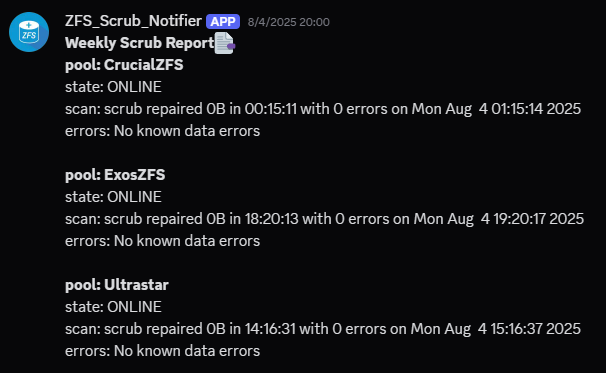

# Proxmox ZFS Scrub Automation
Automate weekly ZFS scrub operations on your zfs pools and receive notifications via Apprise or Discord.

## Features
- Automatically finds all ZFS pools and runs scrubs.
- Sends start and completion notifications with detailed status.
- Supports Apprise and Discord webhook notifications.
- Configurable via `.env` file.

## Screenshots


## Requirements
- `zfs` installed and accessible via `zpool` command.

Install Python dependencies:
```sh
pip install -r requirements.txt
```

## Configuration (optional)
Copy `.env.example` to `.env` and edit as needed (only if you need notification):

```sh
cp .env.example .env
```

Set your notification preferences:

```env
NOTIFICATION_SERVICE = "apprise" # Options: "apprise", "discord"
WEBHOOK_URL = "https://apprise.example.com/notify/apprise"
APPRISE_TAG = "zfs" # Only for apprise notifications
```

## Usage
Run manually:
```sh
python3 main.py
```

### Schedule with `systemd`
1. Place both `.service` and `.timer` into `/etc/systemd/system` folder
2. Change `.timer` timer occurance
3. `systemctl daemon-reload` so systemd knows your new service
4. `systemctl status zfs_scrub.timer` to check if everything is setup correctly

zfs_scrub.service:
```conf
[Unit]
Description=Weekly Scrub ZFS storages

[Service]
ExecStart=/usr/bin/python3 /mnt/Exos_MP/Samba/Dev/Linux/proxmox_zfs_scrub/main.py
User=root
```

zfs_scrub.timer:
```conf
[Unit]
Description=ZFS Weekly scrub

[Timer]
OnCalendar=Mon 1:00
Unit=proxmox_zfs_scrub.service

[Install]
WantedBy=timers.target
```